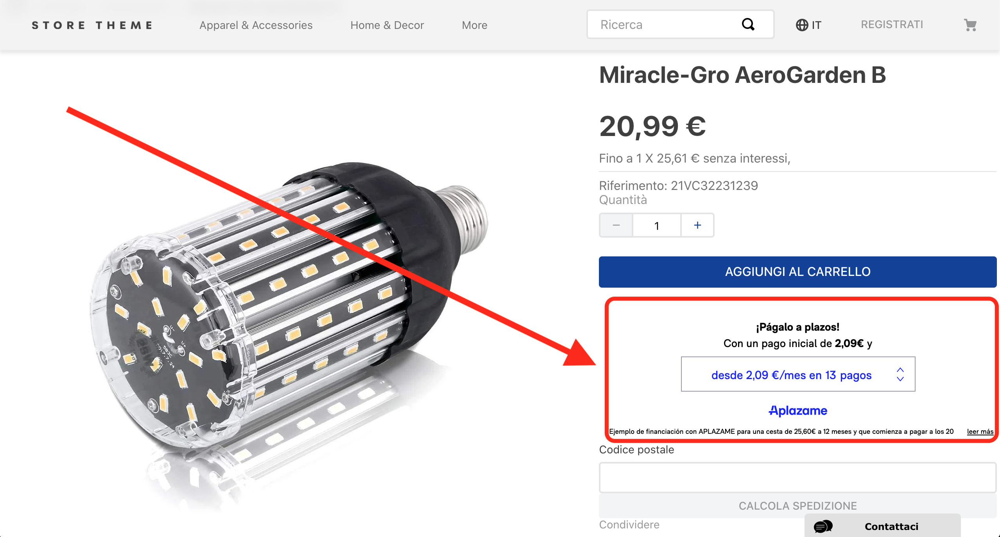

📢 Use this project, [contribute](https://github.com/vtex-apps/CHANGEME) to it or open issues to help evolve it using [Store Discussion](https://github.com/vtex-apps/store-discussion).

# Aplazame Widget

<!-- DOCS-IGNORE:start -->
<!-- ALL-CONTRIBUTORS-BADGE:START - Do not remove or modify this section -->
[](#contributors-)
<!-- ALL-CONTRIBUTORS-BADGE:END -->
<!-- DOCS-IGNORE:end -->

Use this app to display [Aplazame](https://aplazame.com/) widget simulator on your VTEX store products.



## Configuration

First, [install](https://vtex.io/docs/recipes/development/installing-an-app/) the `aplazame.aplazame-widget` app yn the VTEX account which you are working on.

Then, in your VTEX account's admin, open the **App** section and select the Aplazame Widget app configuration. Fill in your *public API key* provided by your store created in [Aplazame's control panel](https://vendors.aplazame.com/) and save your changes.

### Adding widget to your store products

Add the `aplazame-product-widget` block in your store product template (for example: `~/store/blocks/product.jsonc` at `flex-layout.col`):

```diff
"flex-layout.col#right-col": {
    "props": { ... },
    "children": [
      ...
      "flex-layout.row#buy-button",
+     "aplazame-product-widget",
      "availability-subscriber",
      ...
    ]
  }
```

<!-- DOCS-IGNORE:start -->
## Contributors ✨

Thanks goes to these wonderful people ([emoji key](https://allcontributors.org/docs/en/emoji-key)):

<!-- ALL-CONTRIBUTORS-LIST:START - Do not remove or modify this section -->
<!-- prettier-ignore-start -->
<!-- markdownlint-disable -->
<!-- markdownlint-enable -->
<!-- prettier-ignore-end -->
<!-- ALL-CONTRIBUTORS-LIST:END -->

This project follows the [all-contributors](https://github.com/all-contributors/all-contributors) specification. Contributions of any kind are welcome!
<!-- DOCS-IGNORE:end -->
